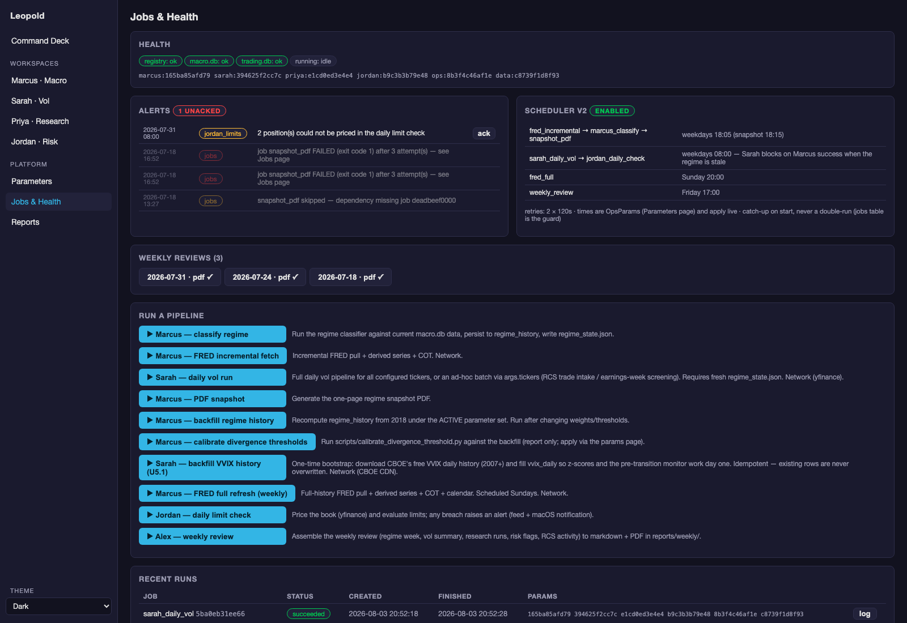

# Alex — Orchestration & Operations

**Status:** ✅ Phase 6 complete (2026-07-18) — scheduler v2, retries, dependency enforcement, alerting, weekly review all live; legacy `scheduler.py` and the :8050 Dash app retired
**Code:** `systems/orchestration/` + `systems/reports/weekly_review.py`
**GUI:** *Jobs & Health* page · **API:** `/api/jobs*`, `/api/ops/*`, `/health`
**Params:** registry component `ops`

## What Alex does, in plain language

Make the system run itself on time, tell you when it breaks, and compress
the week into a review you'll actually read. Alex owns *when* things run and
*whether they ran*; the engines own *what* runs. For a developing trader
this layer is what turns a pile of analysis scripts into an operation with a
rhythm — the same reason a trading desk has an opening checklist.

## The workspace



Health chips (registry / DBs / current job + active parameter hashes) →
**Alerts feed** (with ack) → **Scheduler v2 card** (what runs when, live
from OpsParams) → **Weekly reviews** (browsable archive) → **Run a
pipeline** (manual triggers) → **Recent runs** (status, provenance hashes,
log tails).

## The job system (`systems/orchestration/jobs.py`)

- **One worker, one writer.** Each job runs as
  `python -m systems.orchestration.run_job <name>` in a fresh subprocess: it
  imports the latest registry parameters at start, is the only DuckDB writer
  while it runs, and can crash without touching the API. One job at a time
  is a *feature* (single-writer discipline), not a queue limitation.
- **Provenance per run.** Every job row stamps the active
  `param_hashes` — "what assumptions produced this run?" is always
  answerable, matched against Parameters-page history.
- **Dependencies (`depends_on`).** A job submitted with a dependency will
  **refuse to run** unless that job succeeded — verified live: a job pointed
  at a missing dependency failed with `dependency not satisfied` and raised
  a feed alert instead of running.
- **Retries.** On failure: up to `ops.job_max_retries` resubmissions,
  `ops.job_retry_wait_seconds` apart (retry chain visible in
  `requested_by` as `retry:<origin>:aN`). The alert fires only when retries
  are exhausted — you hear about *problems*, not blips.

**The job menu** (each = one runner + one spec): `marcus_classify`,
`fred_incremental`, `fred_full`, `sarah_daily_vol`, `jordan_daily_check`,
`snapshot_pdf`, `weekly_review`, `backfill_regime_history`,
`backfill_vvix_history`, `calibrate_divergence`.

## Scheduler v2 (`scheduler_v2.py`)

A loop inside the API process, ticking once a minute. Times are **read live
from OpsParams** — edit a schedule time in the GUI and it applies without a
restart. Master switch: `ops.scheduler_enabled`.

| When | Chain | Dependency logic |
|---|---|---|
| weekdays `daily_pipeline_time` (18:05) | `fred_incremental` → `marcus_classify` → `snapshot_pdf` | each depends on the previous succeeding |
| weekdays `vol_run_time` (08:00) | `sarah_daily_vol` → `jordan_daily_check` | if the regime is stale, a fresh `marcus_classify` is inserted first and **Sarah blocks on its success** |
| Sunday `weekly_refresh_time` (20:00) | `fred_full` | full-history refresh; the macro calendar rides every FRED pull |
| Friday `weekly_review_time` (17:00) | `weekly_review` | — |

**Catch-up-on-start, never double-run:** on startup, anything already due
today that has no jobs-table entry today is submitted once. The guard is the
persisted jobs table, not memory — so an API restart can't duplicate a run,
and a laptop asleep at 08:00 still gets its vol run when it wakes.

## Alerting (`alerts.py`)

`raise_alert(source, severity, message)` → a row in `trading.db:alerts`
(the GUI feed, ack-able) **plus** a macOS notification. Producers today:
job failures after retries, dependency refusals, and `jordan_daily_check`
limit breaches. Alerting never takes down the caller — every path degrades
to a log line.

## Weekly review (`systems/reports/weekly_review.py`)

Friday's job assembles the week into `reports/weekly/weekly_review_<date>.md`
+ `.pdf`, browsable in the GUI:

| Section | Source |
|---|---|
| Regime week | `regime_history` + current `regime_state.json` (incl. divergence) |
| Vol summary | latest `vol_signals` per ticker + VVIX/VIX ratio |
| Research runs | MLflow, last 7 days — GO vs failure-archive counts |
| Risk flags | alert feed (7d) + book/limits state + the drawdown-check caveat |
| Journal activity | RCS bridge weekly counts (trades, reviews, observations, theses) |

Every review stamps the parameter hashes it was generated under. Sections
degrade to "not available" notes rather than failing the review — an honest
picture of the week includes which parts produced nothing.

## Process flow

```
scheduler v2 (in-API loop, 60s tick, OpsParams live)
   │ submits (with depends_on)
JobManager queue ── one subprocess at a time ──→ engine pipelines
   │ status/log/param-hashes → trading.db:jobs
   ├─ failure → retries → alert (feed + macOS)
   └─ Friday → weekly_review → reports/weekly/*.md/pdf → GUI archive
```

## Workflows this component serves

- [Running & operating](../04-workflows/running-and-operating.md) — services, jobs, what runs when
- [Weekly operations](../04-workflows/weekly-operations.md) — the Friday review ritual
- [Morning routine](../04-workflows/morning-routine.md) — the alerts feed is step zero

## Operating notes

- Legacy `scheduler.py` and the :8050 Dash app are **retired** (deprecation
  banners in place; `scheduler.py` now exits non-zero if invoked; Dash
  figure builders remain imported by the snapshot generator). Never run
  them.
- **Singleton enforcement** (`systems/orchestration/instance.py`): the
  scheduler and job worker are daemon threads inside the API process, so a
  second API instance would mean a second scheduler *and* a second DuckDB
  writer. The API acquires `data/api.pid` on startup; a new instance
  SIGTERMs (grace, then SIGKILL) any prior holder and takes over. A stale
  PID from `kill -9` is recovered on next start. The PID-reuse guard
  refuses to kill a non-python/uvicorn process — remove `data/api.pid`
  manually if you hit that.
- The scheduler assumes the API process is up; if you run the workstation
  only occasionally, catch-up covers you for the current day — it does not
  backfill missed days (by design: yesterday's vol run on stale prices would
  be worse than no row).
- `regime_staleness_hours_production` (12h) in OpsParams is the *production*
  gate referenced by CLAUDE.md Rule 4; Sarah's own 80h weekend-tolerant gate
  lives in `sarah.regime_staleness_hours`.
