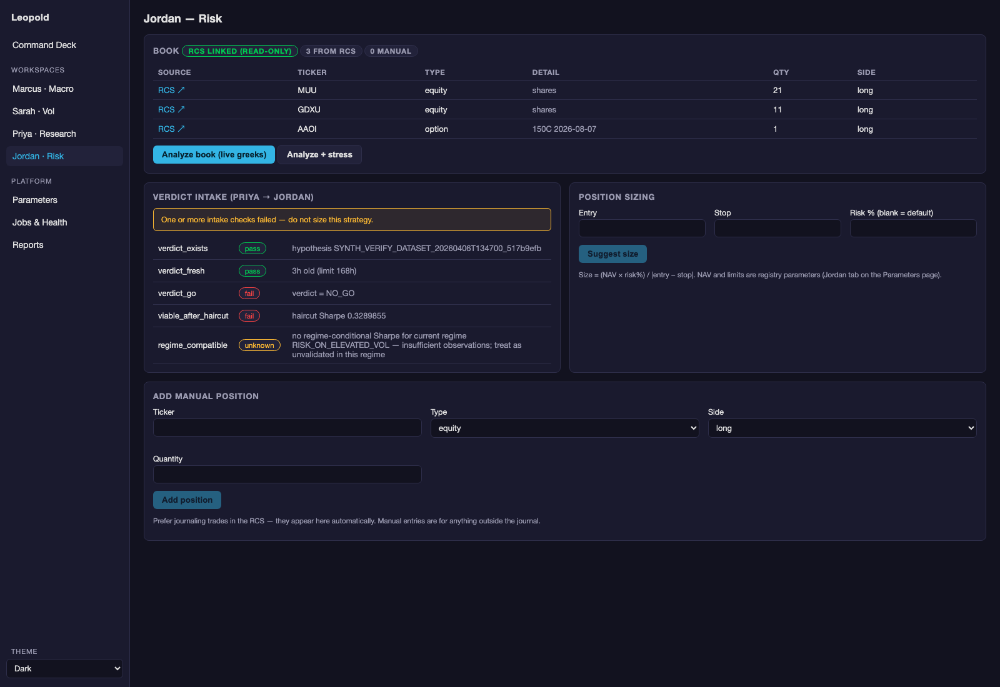

# Jordan — Risk Layer

**Status:** ✅ closed 2026-07-17 — `verify_jordan.py` 21/21 **and** live smoke against the real RCS DB
**Code:** `systems/risk/` · **GUI:** *Jordan · Risk* page · **API:** `/api/jordan/*`
**Params:** registry component `jordan`
**Deeper reference:** [audit #5](../../audit/05_jordan_risk_layer.md) — the audit-as-built, grounded in the risk-desk persona and its source literature (coherent risk measures, liquidity spirals, Kelly)

## What Jordan does, in plain language

Every other component analyzes; Jordan stands between analysis and capital.
The risk desk's one-line job description: **make sure the operation survives
to trade tomorrow.** Concretely, Jordan (a) knows the *actual* book, (b)
prices its aggregate sensitivities, (c) enforces limits that were negotiated
in calm, (d) stress-tests against the historical shock library, and (e) is
the *only* path by which a Priya `GO` becomes a position size — after
re-checking that the verdict is still fresh and still regime-compatible.

> **Learning anchor — hurt vs. kill.** The most important distinction in
> risk management: risks that *hurt* are taken deliberately and managed;
> risks that *kill* get hard limits, no exceptions. Every Jordan surface is
> an implementation of that sentence. Related: limits are **Greeks-based,
> not notional-based** — "2× levered" means nothing for an options book
> (a "1× levered" short straddle has unlimited loss; a "3×" long straddle
> has a defined maximum).

## The workspace



Book view → net greeks → limits panel (with breach banners) → stress table →
verdict intake checklist → sizing calculator → manual position entry.

## Modules

### `rcs_bridge.py` — the journal *is* the book

Opens the Research Capture System SQLite with `mode=ro` — **writes are
impossible at the driver level** (verified live against the real DB;
CLAUDE.md Rule 6 / ADR-003). Pulls `status='active'` trades with net open
size (entries − exits), option legs, and options meta; plus weekly journal
activity counts for the weekly review. Deep links back into the RCS UI
(`:8099`). This is what keeps Jordan honest: the risk board reflects what
you *journaled and did*, not a parallel spreadsheet.

### `book.py` — positions book

- RCS option trades → one position per **open leg**; RCS equity trades →
  net-size share positions.
- Manual fallback for anything unjournaled: `trading.db:jordan_positions`.
- `analyze_book()` prices everything live (yfinance, delayed): options
  through Sarah's `GreeksTool` (7 greeks, position-scaled), equities as
  delta-only. Outputs per-position `delta_dollars`, `vega_dollars`,
  `notional`; portfolio **net greeks** with vanna/charm/vomma concentration
  flags; net delta/vega dollars; gross notional. Per-position pricing
  failures land in an `errors` list — one dead ticker never blinds the board.

### `limits.py` — limits are parameters

| Check | Default | Meaning |
|---|---|---|
| net delta / NAV | ≤ 20% | directional exposure budget |
| net vega / NAV | ≤ 15% | vol exposure budget ($/vol-pt) |
| single position notional / NAV | ≤ 5% | concentration cap |
| drawdown alert / halt | 8% / 15% | **declared, not yet evaluated** — activates when a NAV history exists (top-ranked open item in audit #5) |

All GUI-editable, versioned, hash-stamped. `utilization` per check is the
number the persona keeps asking for: *what is the limit and are we within
it?* Repeatedly approaching a limit without a recalibration conversation is
itself a red flag.

### `stress.py` — the book under the shock library

Every position through Sarah's scenario engine for each named historical
scenario (registry-editable): flat + skew-amplified P&L, per-position
contributions, worst case highlighted. Read the worst case through the
hurt-vs-kill lens against NAV. **Endpoint approximation** — no path, no
liquidity stress; in a real crisis, exit costs run multiples of model
estimates (the March-2020 lesson in audit #5).

### `verdict_intake.py` — the Priya handoff, done defensively

Checklist over `research_verdict.json` + `regime_state.json`: exists →
fresh (≤168h default) → `GO` → viable after haircut → **regime-compatible**
(positive regime-conditional Sharpe for the regime we are in *now*; the
verdict's own `regime_at_verdict` stamp makes a shift detectable). Only all
five green = actionable. Verified live: the stale April NO_GO fails every
check with true ages reported.

`suggest_size(entry, stop)`: units = (NAV × risk%) ÷ |entry − stop|, capped
by the single-position limit. Deliberately fixed-fractional (1% default),
**not Kelly** — at small sample sizes, edge-estimate error makes full Kelly
dangerous (over-betting is catastrophic; under-betting merely slower).

### `jordan_daily_check` — the standing guard (Phase 6)

A scheduled job (weekday mornings, after the Sarah run) that prices the
book, evaluates limits, and **raises an alert** (feed + macOS notification)
on any breach — so limit discipline doesn't depend on you opening the page.

## The v1.0 execution loop (Kai deferred)

```
verdict intake ✔ → sizing suggestion → YOU execute at the broker
      → journal the fill in the RCS → bridge pulls it into Jordan's book
      → net greeks / limits / stress / daily check now include it
```

Manual execution is a *feature* at this stage: the system prepares the
decision and records the context; the human stays the trigger.

## Key outputs, and how to read them

| Output | How to read | Red flag |
|---|---|---|
| net greeks | restate as dollars under a named scenario ("VIX 18→35 = $X") | any cross-greek concentration flag on a book someone called "hedged" |
| limit checks | utilization 0–1 per check | >0.85 repeatedly; any breach banner |
| stress worst case | hurt or kill vs NAV? | worst case exceeding what the drawdown-halt parameter implies you'd tolerate |
| intake checklist | all five green or don't size | reasoning around a failed check ("only a week stale") |
| sizing | `capped_by` set = the limit bound first, not your formula | consistently capped → stops too tight for the limit structure |

## Workflows this component serves

- [Risk & sizing](../04-workflows/risk-and-sizing.md) — the full GO→size→journal loop
- [Morning routine](../04-workflows/morning-routine.md) — book + limits glance; alerts arrive by themselves
- [Weekly operations](../04-workflows/weekly-operations.md) — risk flags section of the weekly review

## Open gaps (ranked in audit #5 — deliberate, tracked)

1. Drawdown tiers need a NAV/P&L series (lands with weekly-review history).
2. Regime-contingent limit tightening (Marcus flags a shift → limits tighten
   *before* confirmation) — v1.0 limits are static.
3. Greeks by bucket (vega by tenor, gamma by strike) — net numbers can hide
   concentrations.
4. Liquidity checks (`min_liquidity_days` is a parameter without an
   evaluator — needs paid bid/ask data; deferred with the paper posture).
5. Correlation/crowding monitoring — matters once multiple strategies run.
