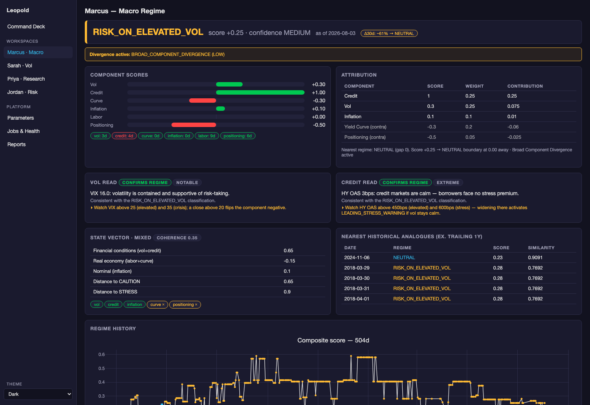

# Marcus — Macro Regime Classification

**Status:** classifier ✅ live since Phase 1 · v1.0 analytics ✅ (platform suite green; golden-master-verified refactor)
**Code:** `systems/signals/regime_classifier.py`, `systems/signals/regime_analytics.py`
**Feeds:** `systems/data_feeds/macro_feed.py` · **GUI:** *Marcus · Macro* page + Command Deck
**API:** `/api/marcus/*` · **Params:** registry component `marcus` ([schema](../03-contracts/parameter-schemas.md#marcus))
**Deeper reference:** [audit #2](../../audit/02_marcus_macro_layer.md)

## What Marcus does, in plain language

Before you think about any single trade, you need one honest sentence about
the environment: *is the market paying you to take risk right now, or
charging you?* Marcus produces that sentence every evening, as a six-state
label — `RISK_ON_LOW_VOL` → `RISK_ON_ELEVATED_VOL` → `NEUTRAL` → `CAUTION` →
`RISK_OFF_STRESS` → `CRISIS` — plus how confident the label is and whether
it's starting to crack.

Marcus is the system's **context gate**: Sarah's daily run, Priya's research
verdicts, and Jordan's sizing all refuse to act against a stale regime.
That's CLAUDE.md Rule 4, enforced in code, and it exists to protect you from
the most common beginner error — analyzing a trade as if the environment
doesn't matter.

> **Learning anchor.** A *regime* is descriptive, not predictive: it says
> what the macro data looks like **now**. The value for a developing trader
> is discipline — position sizes and strategy choices that are appropriate
> at VIX 14 are wrong at VIX 30, and the regime label makes that switch
> explicit instead of emotional.

## The workspace



The page is ordered by decision priority (fragility-first — the thing that
changes your behavior sits on top):

1. **Fragility headline** — STABLE / WATCH / FRAGILE / BREAKING. This, not
   the label, is the 7am number: a stable CAUTION needs less attention than
   a breaking RISK_ON.
2. **Regime badge** + composite score + confidence.
3. **Divergences** — components telling contradictory stories (the
   actionable one: `LEADING_STRESS_WARNING` = credit stressed while vol is
   calm, historically precedes vol spikes).
4. **Transition probability** — heuristic ~30-day chance the label changes.
5. **Component vector** — the six −1…+1 scores that made the composite.
6. **Return implications** — what SPY/TLT/GLD/HYG/UUP historically did in
   this regime (medians + quartiles, with sample-size reliability flags).
7. **Charts** — regime history ribbon, any macro series with z-bands.

## How classification works (the full computation)

1. `_load_snapshot()` pulls the latest value, z-score, and date for ~20
   series from `macro.db:macro_series` (VIX, HY/IG spreads, 10Y−2Y and
   10Y−3M curves, 10Y breakeven + 5y5y forward, real rates, PCE YoY,
   unemployment + 3m delta, jobless claims z, M2 YoY, oil, SP500 COT z).
2. Six **component scorers** each map their inputs to −1…+1 using the
   threshold families in `MarcusParams.regime_thresholds` (e.g. VIX < 15 →
   +1.0; HY > 900bps → −1.0). Missing data scores 0 (neutral) and is listed
   in `missing_inputs` — never silently dropped.
3. Weighted sum (`component_weights`: vol .25, credit .25, curve .20, labor
   .15, inflation .10, positioning .05) → **composite score** → regime label
   via the `score_to_regime` floors (+0.60 / +0.25 / −0.10 / −0.40 / −0.65).
4. **Confidence** from sign-agreement among the five fundamental components
   (≥0.8 → HIGH, ≥0.6 → MEDIUM); positioning is excluded (it's contrarian —
   crowded longs are a warning, not a confirmation).
5. **Divergence detection:** vol-vs-credit spread ≥ 0.6 fires
   `LEADING_STRESS_WARNING` (credit stressed, vol calm) or
   `ELEVATED_VOL_UNCONFIRMED`; vol+credit stressed while labor strong fires
   `LABOR_LAG_WARNING`; max−min component spread ≥ 1.2 fires the LOW-severity
   broad-divergence flag.
6. Persist to `macro.db:regime_history`; `write_output_contract()` writes
   [`regime_state.json`](../03-contracts/output-contracts.md#regime_statejson).

Every number in steps 2–5 is a registry parameter. The classifier asserts
weights sum to 1.0 at construction, and accepts an injected `MarcusParams`
for the GUI's **preview** ("what regime would today be under these
weights?") without touching the live registry.

## Key variables, and how to read them

| Variable | Range | How to read | Red flag |
|---|---|---|---|
| `composite_score` | −1…+1 | above +0.25 = risk-on territory; below −0.10 = caution and worse | big label jump day-over-day without a news catalyst → check `missing_inputs` |
| `component_scores.*` | −1…+1 each | the *story*: which dimension is driving | one component pinned at ±1 for weeks (threshold saturation) |
| `confidence` | HIGH/MEDIUM/LOW | agreement count, **not** signal strength | LOW = components disagree — trust the vector, not the label |
| `divergence_type` | enum/null | contradictions between components | `LEADING_STRESS_WARNING` — tighten before vol confirms |
| fragility | 4-state | is the label *stable*? | FRAGILE/BREAKING with rising transition probability |
| `transition_prob` | 0–0.85 | attention-allocation heuristic | treat as a dial, never a forecast |
| `missing_inputs` | list | series that scored neutral for lack of data | more than 2–3 entries → the composite is degraded; run `fred_incremental` |

## The analytical layers on top (v1.0)

| Layer | What it answers | API |
|---|---|---|
| Attribution | which components drive vs contradict; distance to the nearest flip | `/api/marcus/summary` |
| Fragility | STABLE/WATCH/FRAGILE/BREAKING + divergence duration & trend | `/api/marcus/fragility` |
| State vector + geometry | sub-composites (financial conditions / real economy / nominal), distance-to-stress, configuration type (e.g. `CREDIT_LED_STRESS`) | `/api/marcus/state-vector` |
| Historical analogues | nearest past dates in six-score space (trailing year excluded) | in state-vector |
| Interpreter (vol+credit) | plain-language read + an explicit **watch condition** — the falsifier for today's read | `/api/marcus/interpretations` |
| Return implications | regime-conditional 1M/3M asset stats with n-obs reliability flags | `/api/marcus/implications` |
| Preview | re-score today under edited params without persisting | `POST /api/marcus/preview` |

## Process flow

```
weekday evenings (scheduler v2, OpsParams.daily_pipeline_time)
  fred_incremental  ── FRED + COT + macro calendar → macro.db
        │ depends_on success
  marcus_classify   ── score → regime_history + regime_state.json
        │ depends_on success
  snapshot_pdf      ── one-page PDF snapshot
        ▼
  regime_state.json  → Sarah (hard gate) · Priya (regime_at_verdict stamp)
                     · Jordan (verdict intake regime check) · Command Deck
```

## Workflows this component serves

- [Morning routine](../04-workflows/morning-routine.md) — the 7am fragility-first read
- [Regime context](../04-workflows/regime-context.md) — regime + vol-surface analogs together
- [Editing parameters](../04-workflows/editing-parameters.md) — weights/thresholds with preview + `backfill_regime_history` re-run
- [Research validation](../04-workflows/research-validation.md) — regime-conditional Sharpe tables come from `regime_history`

## Known limitations (from audit #2 — unchanged, deliberate)

- Weights and thresholds are expert-set, not empirically calibrated;
  `calibrate_divergence` exists as a job for the divergence pair.
- Hard thresholds create cliff effects (VIX 24.9 vs 25.1 scores differently).
- The label is coincident/lagging; the fragility layer exists precisely
  because transitions, not levels, carry the value.
- Positioning scores SP500 COT only, despite six instruments being ingested.
- Regime-conditional weights (Gap 2) and the forward scenario layer (Gap 6)
  are deliberately deferred to v1.1 (need longer validated backfill).
