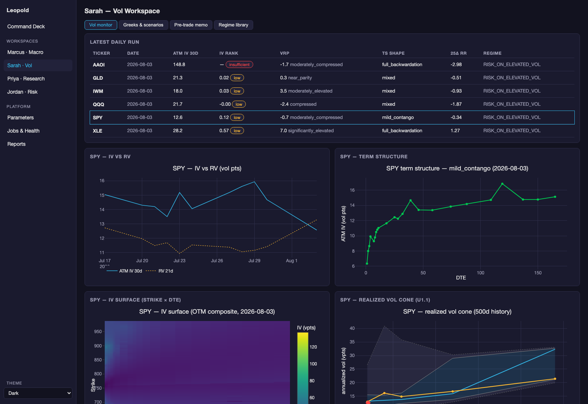
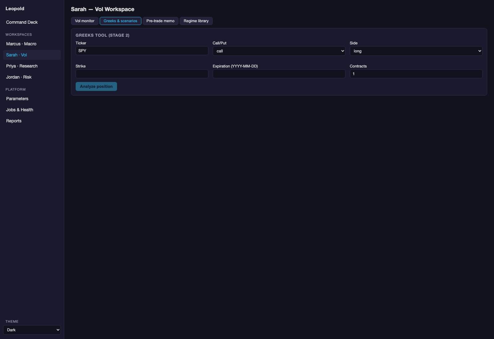
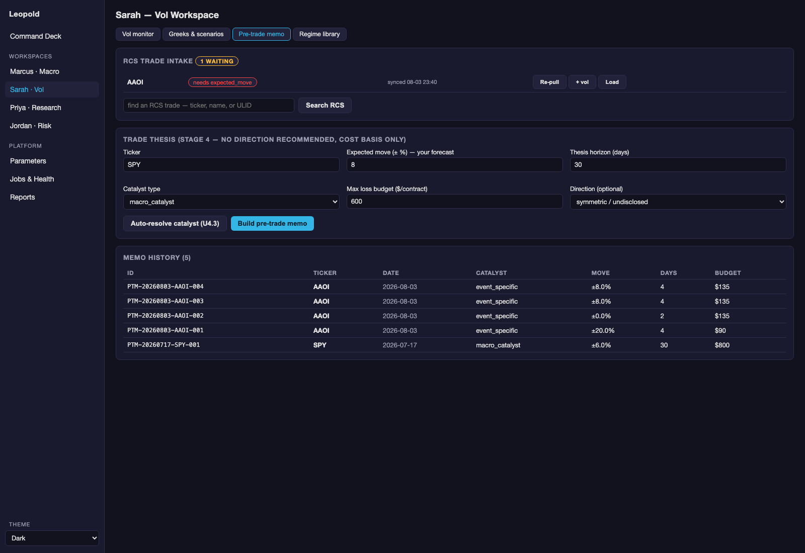
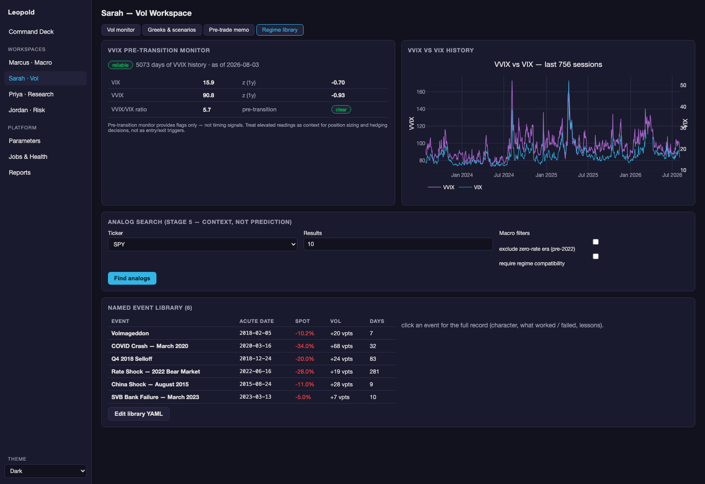

# Sarah — Vol Surface & Pre-Trade Intelligence

**Status:** all five tools ✅ live and verified end-to-end (2026-07-17)
**Code:** `systems/sarah/` + `research/signals/` + `systems/data_feeds/{options,cboe}_feed.py`
**GUI:** *Sarah · Vol* page (five tabs) · **API:** `/api/sarah/*` · **Params:** registry component `sarah`
**Deeper reference:** [audit #3](../../audit/03_sarah_vol_layer.md) (output literacy per signal)

## What Sarah does, in plain language

Options prices contain a forecast: how much the market thinks an underlying
will move, and how afraid it is of which direction. Sarah reads that forecast
off the listed options chain every day, turns it into a small set of named
signals, and gives you position-level tools to reason about a trade *before*
you place it.

The design rule that makes Sarah trustworthy for a developing trader:
**Sarah describes what the market is pricing; she never recommends a
direction.** Every number is a cost or a probability, not advice. You bring
the thesis; Sarah tells you what expressing it costs and what has to be true
for it to pay.

> **Learning anchor.** If you're new to options, read the
> [glossary](../00-system/glossary.md) sections *Vol & options* first —
> especially IV vs RV, term structure, skew, and the greeks. Every Sarah
> screen assumes those six ideas.

## The workspace



Five tabs, one per tool cluster:

| Tab | Tool | Question it answers |
|---|---|---|
| **Vol monitor** | daily signals + 4 charts | "What is the options market pricing today, and is that high or low?" |
| **Greeks & scenarios** | greeks tool → scenario lab | "What are this position's sensitivities, and what happens to it under moves, crushes, and crises?" |
| **Pre-trade memo** | 5-panel memo builder | "Given my thesis, what does expressing it cost, and which structure fits my budget?" |
| **Regime library** | analog search + VVIX monitor + event browser | "When did the vol surface look like this before, and what is vol-of-vol warning about now?" |
| **Batch & compare** | ad-hoc multi-ticker scan + ranked comparison | "Across this earnings-week list, which names have the richest vol, and which are cheap?" |

---

## Tool 1 — Vol monitor

**Runs on:** persisted output of the daily job (`sarah_daily_vol`, scheduled
weekday mornings — see [jobs & scheduling](../02-platform/jobs-and-scheduling.md)).
Nothing on this tab hits the network; it reads `trading.db`.

### The signals table (one row per ticker)

| Column | Unit / range | How to read it | Red flag |
|---|---|---|---|
| `atm_iv_30d` | vol points (SPY calm: 12–18) | Annualized move the market prices for ~30 days. ÷√12 ≈ expected 1-month move: IV 15 ≈ ±4.3%/month | 0/None (chain fetch failed); >100 or <3 (data error) |
| `iv_rank` | 0–1 | Where today's IV sits in its 1y min–max. 0.85 = premium historically expensive | chip shows `insufficient` — under 60 days of history the number is math, not meaning |
| `iv_percentile` | 0–1 | Fraction of past days with lower IV. Diverges from IVR after spike years; IVP is usually more representative | same confidence caveat |
| `vrp_proxy_bkwd` + signal | vol points + 6-state enum | IV minus recent realized. +1…+6 normal (sellers get paid); `inverted` = market moving more than options price — dangerous to sell | `inverted` outside an obvious event |
| `ts_shape` | 6-state enum | `*_contango` normal; `humped` = event premium in the front; `full_backwardation` = stress | backwardation with no known catalyst |
| `skew_25d_rr` | vol points, equities −8…−1 | How much richer 25Δ puts are than calls (insurance demand) | near 0 or positive on an index (check data); < −10 without a VIX spike |
| `macro_regime` | Marcus label | The regime this row was computed under — Sarah refuses to run on a stale regime | — |
| `next_earnings_date` | iso date or null | Nearest upcoming earnings at run time, stamped so the compare view's earnings flag is a pure DB read (no network in the read path) | null when yfinance reports no calendar |
| `data_source` | `yfinance` \| `unusual_whales` | Provenance tag. The daily/batch run writes `yfinance`; the future UW backfill writes `unusual_whales`. Lets the UW import honour its "today's yfinance row wins" guardrail | — |

### The four charts

1. **IV vs RV** — implied (what's priced) over realized (what happened).
   The gap *is* the VRP. Note: with only days of history the x-axis is
   cramped; it becomes readable as the daily run accumulates.
2. **Term structure** — ATM IV at every listed expiration (24 tenors out to
   ~250 DTE after the deep-chain upgrade). Shape label in the title.
3. **IV surface heatmap** — strike × DTE, OTM-composite (puts below the
   forward, calls above), IV in color. The "smile" you read about is visible
   here directly: the bright band at low strikes is the put wing.
4. **Realized vol cone (U1.1)** — percentile bands (p5/p25/median/p75/p95) of
   realized vol at 20/40/60/120/240-day windows (Hodges-Tompkins corrected
   for overlapping windows), current RV per window in amber, and today's ATM
   IV as a red diamond. **This is the buy/sell-vol context chart**: selling
   IV 15 when the 1-month realized range has been 11–35 is a different trade
   than selling 15 when the range has been 13–17.

### Computations behind the signals (the honest versions)

- **ATM IV** = average of call and put IV at the strike nearest the *forward*
  price (F = S·e^((r−q)t)), per expiration; 30/60/180d tenors interpolated
  from listed expirations.
- **RV 21d** = std-dev of daily log returns × √252 — backward-looking by
  construction.
- **VRP proxy** = `atm_iv_30d − rv_21d`. The tenors deliberately don't match
  (30d forward-implied vs 21d trailing realized); true VRP needs future
  realized vol you can't know yet. Treat as a spread between two forecasts.
- **IVR** = (IV − min)/(max − min) over stored history; **IVP** = share of
  days below today. Both are only as good as accumulated history —
  `ivr_ivp_confidence` says exactly how much history backs the number.
- **Skew slice** = IV at the strikes nearest 25Δ/10Δ per wing; full 5Δ–50Δ
  grid stored in `skew_by_delta_json`.
- **Vol cone** = rolling RV percentiles with the Hodges-Tompkins correction
  (overlapping windows understate variance; the correction re-inflates it).

---

## Tool 2 — Greeks & scenarios



### Greeks tool (Stage 2)

Enter one position (ticker, call/put, strike, expiration, contracts, side) →
live-priced analytic Black-Scholes greeks, per-contract and position-scaled:

| Greek | Unit | Plain meaning |
|---|---|---|
| delta | shares-equivalent | P&L per $1 spot move; also ≈ market-implied P(ITM) |
| gamma | delta per $1 | how fast delta changes — convexity |
| theta | $/day | the rent you pay (long) or collect (short) daily |
| vega | $/vol-pt | P&L per 1-point IV change |
| vanna | delta per vol-pt | **cross-greek**: your delta hedge drifts as vol moves |
| charm | delta per day | your delta drifts as time passes |
| vomma | vega per vol-pt | your vega grows as vol rises (short-vol pain accelerator) |

The interpretation block restates all of it in sentences — read it until the
table alone is enough. IV source ladder: live chain → stored ATM IV → 18%
fallback (always flagged). A skew-based flag warns when Black-Scholes'
flat-vol assumption is being stretched.

### Scenario lab (Stage 3)

One click from an analyzed position:

- **P&L grid** — spot (±30%, 2.5% steps) × IV (±25 vpts) heatmap at
  0/25/50/75% of time elapsed. Widens automatically in high-vol regimes
  (VIX > 25). Read it as: *where do I make/lose money in (move, vol) space,
  and how does that change as expiry approaches?*
- **Stress scenarios** — the named historical library (Volmageddon, March
  2020, 2022 rates shock…, all **registry-editable**), applied as endpoint
  spot% + ABSOLUTE vol-point shocks; the *skew-amplified* column bumps OTM
  put IV harder than ATM, which is what actually happens in a crash.
- **Kill scenario** — max realistic loss if the thesis just fails: spot flat,
  IV −8 vpts by day 30 (both registry parameters). If this exceeds your
  budget, the position is too big *before* anything goes wrong.

**Limitation to know:** the grid is flat-vol Black-Scholes; skew response
lives only in the named scenarios. Stress is endpoint, not path — a position
that survives the endpoint may still die of margin calls along the way
(path reconstruction is gated on paid CBOE historical data, deferred).

---

## Tool 3 — Pre-trade memo builder (Stage 4)



The discipline tool. You articulate a thesis in five fields — the memo tells
you what the market charges for it. Nothing here says "buy" or "sell".

**The thesis form:**

| Field | What it forces you to decide |
|---|---|
| `expected_move` (±%) | the *magnitude* you believe in (unsigned — direction optional) |
| `thesis_days` | your time horizon |
| `catalyst_type` | *why* it happens: `event_specific` / `macro_catalyst` / `macro_slow` / `technical` |
| `max_loss_budget` ($/contract) | what you'll pay to be wrong |
| direction (optional) | only used to price which wing your bias pays for |

**Auto-resolve catalyst (U4.3)** looks up the next earnings (yfinance) and
importance-1 macro events (FOMC/CPI/PCE/NFP from `macro_calendar`) and
pre-fills catalyst type + horizon — you confirm. The lookup is automated;
the judgment stays yours.

**The five panels it returns:**

1. **Vol level** — IV, IVR/IVP with confidence, daily theta ≈, monthly carry
   in vol points, **roll-down and roll-adjusted carry** (GAP-002: a 60d
   option held 30d re-marks down the term structure in contango — the flat
   number misses that cost), break-even move %, 52-week IV range, and a
   one-word `cost_burden` verdict (low/moderate/high).
2. **Term structure** — shape, slopes + percentile, IV at your thesis
   expiry, event-premium flag, roll costs for slow theses, and a
   recommended DTE with its reasoning (e.g. "front premium elevated;
   extending to reduce event premium cost").
3. **Skew** — wing costs vs ATM, tail steepness, where your directional bias
   is expensive.
4. **Flow** (optional) — a structured form for an unusual-options-activity
   observation; the panel characterizes it factually (net delta direction,
   size context, expiration alignment with *your* thesis) and explicitly
   refuses to assign it meaning.
5. **Implied distribution (BL density)** — the market's own probability
   distribution for expiry, extracted from call prices
   (Breeden-Litzenberger: the second derivative of call price w.r.t. strike
   *is* the density). Shows P(±5/10/15%), implied 1-SD move, skewness,
   kurtosis — with a reliability flag when the chain can't support it.
   **The flag is a two-sided band on `total_mass` (0.85–1.15).** A density
   must integrate to 1.0, so mass far *above* 1 is as broken as mass below:
   BL is a second derivative, so it amplifies quote noise, and a sparse
   wide-spread short-dated chain can integrate to many multiples of 1. The
   original gate tested only `>= 0.85` and passed AAOI's 4-DTE density at
   **mass 13.71** as `reliable: true` (fixed 2026-08-03). Tell-tale
   companion symptom: *negative* excess kurtosis on an event chain, which
   should be fat-tailed. When the flag trips, the 1-SD figure is still worth
   cross-checking against the ATM straddle; the shape and the moments are not.

**Structure comparison:** seven candidate expressions (ATM call/put, OTM
call/put, call/put spread, straddle) priced from the live chain at your
expiry, with P&L at ±your-move and an **in budget / over budget** chip
against your max loss.

**Persistence:** every memo is saved to `pretrade_memos` with a stable ID
(`PTM-YYYYMMDD-TICKER-NNN`). That ID is the cross-link key — an RCS trade
note (and later a Knowledge-Library citation — see
[Ashurbanipal integration](../06-knowledge/ashurbanipal-integration.md)) can
reference exactly the memo that justified the trade. A memo built for an RCS
trade also stores that trade's ULID (`pretrade_memos.rcs_trade_ulid`), so the
link is structural in *this* direction rather than a copy-paste. History is
browsable at the bottom of the tab; clicking a row re-renders the stored memo.

### RCS trade intake

**Status:** ✅ live (2026-08-03) · **Code:** `systems/sarah/trade_intake.py`
· **Verify:** `python scripts/verify_sarah_intake.py`

A trade committed in RCS used to be unanalysable here without manual work:
the ticker was probably outside `sarah.vol_tickers`, so every Sarah screen was
empty, and you retyped the position by hand. Intake closes that.

**Every field Sarah needs is in exactly one of three classes, and only Class C
is ever shown to you.**

| Class | Where it comes from | Examples |
|---|---|---|
| **A — auto (trading)** | the pipeline | chain, ATM IV, surface, term structure, skew, IVR/IVP, VRP, vol cone, VIX/VVIX/regime, next earnings + macro catalyst |
| **B — in RCS** | `rcs_bridge`, read-only | legs (type/strike/expiry/contracts/direction), strategy, defined max loss, instrument |
| **C — you** | judgment, nowhere else | **`expected_move`**, the underlier map for a no-chain ticker, an optional flow observation, and confirmations only where A/B were genuinely ambiguous |

The target: **for a single-leg option trade with a known catalyst, the only
thing you are ever asked is `expected_move`.** A schema sweep of the live RCS
journal (2026-08-03) confirmed no target/expected/move/magnitude/direction
field exists anywhere in it — Class C is genuinely absent from RCS, not merely
un-mapped.

**The trigger.** A trade going `idea → active` in RCS (and, while
`sarah.intake_fire_on_idea` is on, being *created* as an idea) writes an
`entity_events` row. The intake poll reads that read-only, resolves the
ticker through `sarah.underlier_map`, stores everything A and B can fill, and
enqueues one coalesced `sarah_daily_vol` batch. RCS is not modified in any
way — no button, no callback, no write (ADR-003). To analyse something
immediately instead of waiting for the poll, `POST /api/sarah/intake` runs the
same path for one trade; it is also the hook an RCS "Send to Sarah" button or
the future LLM layer would call.

**Two phases, so nothing waits on judgment.**

- **Phase A — data-ready, zero input.** The moment the job succeeds, the vol
  monitor for the ticker and the greeks + scenario lab *for the exact
  position* are live. None of that needs `expected_move`.
- **Phase B — memo-ready, one input.** Only the memo waits, and only for your
  forecast. Everything else on the form arrives pre-filled.

**Why the memo is worth running at both stages.** The structure comparison is
a *chooser* — it prices seven candidate expressions at your expected move and
flags which fit budget — so it is most valuable at `idea` stage, while the
structure is still open. On an already-active trade the legs are frozen, and
the memo runs retrospectively: `expected_move` still drives the two things
that stay meaningful on a fixed position — the **break-even check** (is my
forecast larger than the premium's break-even?) and the **belief-vs-implied**
read — while the greeks/scenario lab is the live monitor for the position
itself. That is why intake fires at idea stage by default.

**The one thing the form will not do for you.** When it asks for
`expected_move` it *shows* the market's implied move beside the field, clearly
labelled as reference — and never uses it as the default. Pre-filling it would
collapse your independent forecast onto the market's, which destroys the one
comparison the memo exists to make. Sarah prices; you supply the belief.

**`expected_move` is an unsigned, non-zero decimal fraction** — `0.20` means
±20%, not `20`. The memo builder computes `forward × (1 ± expected_move)`, so
both ends of the range matter:

- **Too large** — a stray `20` (meaning 20%) would price a 2000% move.
- **Zero** — a browser sends `Number("") === 0` for an empty numeric field.
  A zero move collapses the ATM and both OTM candidate strikes onto the same
  strike, makes each spread a long-and-short of the identical contract (cost
  exactly 0), and evaluates "P&L at +move" and "at −move" at the same
  unchanged spot. The memo still renders completely, which is what makes it
  dangerous: it looks like an answer. *(Observed live 2026-08-03 on
  `PTM-20260803-AAOI-002`.)*

The endpoint enforces `0.001 ≤ x ≤ 1.5` and the form refuses to submit an
empty or zero field. Same trap, same fix, for `thesis_days` (≥ 1),
`max_loss_budget` (> 0), and Jordan's position `quantity`/`strike` (non-zero).

**Re-pulling a trade you've already pulled.** RCS records change after you
first bring a trade in — you capture the option leg, fill in a defined max
loss, correct the thesis budget. Re-pull is the same idempotent call as the
first intake (the **Re-pull** button on each row, or `POST /api/sarah/intake`
with the same ULID), and the merge is per-field:

| Field | On re-pull |
|---|---|
| `expected_move` | **never touched.** It has no derivation — nothing upstream can set it, so nothing upstream can disturb it |
| `thesis_days`, `catalyst_type`, `max_loss_budget`, `expected_move_sign` | **refreshed from RCS**, unless you set that field yourself (recorded in `user_overrides`) |
| `ticker` / `rcs_instrument` | always refreshed — the underlier map may have gained an entry |

Set a field through the form and it becomes yours; a later re-pull leaves it
alone. Clear it back to empty and RCS owns it again. The response reports
`changed` so a real update is distinguishable from a no-op, and re-pull won't
spend an options-chain fetch when the ticker already has today's data (the
**+ vol** button forces one).

> The earlier merge rule was "any stored value wins", which quietly froze
> Class-B data: a leg captured *after* the first intake never reached Sarah.
> Fixed 2026-08-03 — this table is the corrected contract.

**Why re-pull can't be fully automatic — and what happens instead.** RCS emits
no usable event when an option leg is captured: inserting a leg fires no
trigger at all, and *editing* one writes an `entity_events` row whose
`entity_id` is `leg:<leg_id>`, not the trade ULID. The watermarked event poll
therefore cannot see it, and we don't modify RCS (ADR-003). So the poll also
**re-reads every trade it already tracks** on each cycle — pure SQLite reads
against the journal, with the yfinance catalyst lookup skipped when a catalyst
is already known, and no vol job unless the resolved ticker actually changed.
Net effect: a leg you capture in RCS reaches Sarah within one poll cycle
anyway, and the button is there for when you don't want to wait.

**Finding a trade without its ULID.** Nobody memorises a ULID, so both intake
surfaces carry a search box over `GET /api/sarah/rcs-trades` — match on
ticker, trade name, or ULID across idea/active trades. Results show
`leg_count` (whether the position surfaces will have anything to price) and
offer **Analyse** or **Re-pull** depending on whether Sarah already tracks it.

**When it can't finish.** Two failures surface as the *same* blocking question
rather than an empty screen: a ticker with no options chain and no
`underlier_map` entry, and a vol pull that failed anyway (delisted, thin,
yfinance throttle). Both land in `sarah_trade_inputs.last_error` and appear as
`needs_user: ["underlier", …]`. Prefer fixing it by adding the mapping to
`sarah.underlier_map` on the Parameters page — that is reusable for every
future trade on that ticker, where a per-trade override is not.

**Precondition worth knowing:** the legs must exist in RCS. Until the trade's
`trade_option_legs` row is captured there, the bridge returns an option trade
with no legs — the ticker-level vol pull still runs, but the greeks/scenario
surfaces have no position to price. RCS leg capture is upstream of this whole
seam.

---

## Tool 4 — Regime library (Stage 5)



Three instruments for the same question: *what kind of vol environment am I
actually in?*

### VVIX pre-transition monitor

VVIX is the vol of VIX — how uncertain the market is about volatility
itself. The warning pattern: **VVIX elevated (z > 1.5) while VIX is calm
(z < 0.5)** — historically this "nervous calm" precedes regime transitions.
Thanks to the 2006→present CBOE backfill (5,063 days), z-scores are
**reliable from day one** instead of after a year of accumulation. Also
shown: VVIX/VIX ratio (3.5–6.0 typical; >6 = elevated), and a macro.db
staleness warning (GAP-001) if the VIX feed behind `vix_z1y` has gone stale.
**Flags only — never a timing signal.**

### Analog search

Builds a 6-dimensional fingerprint of today's surface — vol level, IV rank,
front/back term-structure slopes, 25Δ skew, VIX z-score (computed at runtime
from macro.db, 1990→present), plus VVIX z-score as a 7th feature — and finds
the most similar historical days (z-normalized Euclidean distance, macro
regime compatibility filter available). Read results as *context, not
prediction*: "the last times the surface looked like this" is the start of
your research, not its conclusion.

**Honesty built in:** with a young library the response says so
("N days of searchable history, minimum 120") — the pool fills as the daily
run accumulates; the 20-year CBOE bootstrap (U5.2) is a deliberately
deferred paid gate.

### Event browser

The hand-curated library of named vol events (Volmageddon, COVID, Q4 2018,
2022 rates, CNY 2015, SVB) — dates, surface state before, what worked, what
failed, lessons. Click for the full record; the YAML is editable in the GUI
(validated on save, previous version kept as `.bak`). Add an entry after
every significant episode you live through — this is your institutional
memory.

---

## Tool 5 — Batch & compare

The daily universe is five ETFs. Screening an earnings calendar (AMD, PLTR, PFE,
LLY, SNDK, CAT, SHOP, WDC…) needs an ad-hoc path plus cross-ticker ranking.

**Batch scan.** A textarea + "Run batch" submits the ticker list as a
`sarah_daily_vol` job with `args.tickers` (the same intake seam RCS trade intake
uses). It runs through the *exact same* Stage 1 pipeline — chain → term
structure → skew → signals → DB — and persists to `vol_signals`/`vol_surface`
just like the daily run. It deliberately does **not** overwrite
`data/outputs/vol_signals.json` (that file is the daily run's context snapshot).
A registry-editable inter-ticker delay (`batch_inter_ticker_delay_s`, default
1s) paces yfinance; `skip_regime_check` is on by default (screening is the use
case the flag was built for). Status is polled from the job queue — the same
single-writer discipline as every other job.

**Compare view.** Once a batch has signals in the DB, the compare card shows a
sortable ranking table (IV rank, VRP spread, TS shape, 25Δ RR, RV, earnings
flag, regime) with per-dimension rankings (★ = rank 1), plus three multi-ticker
overlays:

- **Term structure overlay** — ATM IV by DTE, one line per ticker.
- **ATM IV 30d history** — trailing IV lines per ticker.
- **Vol opportunity map** — scatter of IV rank (x) vs VRP spread (y), bubble
  size ∝ ATM IV. Top-right = premium-selling candidates; bottom-left =
  long-premium / cheap-hedge candidates.

All four compare endpoints are **pure `trading.db` reads — no yfinance, no
network**. Drill into any candidate via the per-ticker Vol monitor charts and
the Pre-trade memo builder.

**Provenance.** Each `vol_signals` row carries a `data_source` tag
(`yfinance` for the daily/batch run, `unusual_whales` for the future UW
backfill). This lets the planned UW historical import honour its
"today's yfinance row wins" guardrail without guesswork, and keeps the compare
view single-shape regardless of source.

---

## Process flow

```
06-Jul regime_state.json (Marcus, must be fresh — hard gate, 80h weekend-tolerant)
        │
sarah_daily_vol (scheduled weekday mornings; blocks on Marcus success when stale)
  ↑ also fired ad-hoc with args.tickers by RCS trade intake / batch screening
  │     RCS trade idea→active ─→ entity_events ─(read-only)→ sarah_intake_poll
  │        ─→ sarah_trade_inputs (Class B/A pre-fills) ─→ this job
  yfinance chains (chain_max_expirations=24/ticker) + CBOE VIX/VVIX
        │ per ticker: enrich chain → term structure → skew (25Δ/10Δ + 5–50Δ grid)
        │             → IVR/IVP → VRP proxy → P/C open interest
        ▼
  trading.db: vol_signals (1 row/ticker/day) · vol_surface (strike×expiry)
              · vvix_daily          + data/outputs/vol_signals.json
                                      (daily mode only — batch runs skip it)
        │
        ├─→ Vol monitor (reads persisted signals — no network)
        ├─→ Memo builder (persisted signals + live chain for pricing/density)
        ├─→ Regime library (vol_signals history + macro.db VIX + vvix_daily)
        └─→ Jordan (GreeksTool reused for the book) · jordan_daily_check
```

## Workflows this component serves

- [Morning routine](../04-workflows/morning-routine.md) — vol monitor scan after the regime read
- [Pre-trade analysis](../04-workflows/pre-trade-analysis.md) — the full memo discipline, start to RCS journal
- [Regime context](../04-workflows/regime-context.md) — analogs, VVIX, event history
- [Risk & sizing](../04-workflows/risk-and-sizing.md) — greeks/scenarios feed Jordan's book view

## Parameters that shape Sarah (registry `sarah`)

`vol_tickers` (universe) · `chain_max_expirations` (24 — weekly-chain tickers
need depth or the term structure degrades to a flat extrapolation) ·
`regime_staleness_hours` (80, weekend-tolerant hard gate) · IVR/analog/VVIX
history minimums · full scenario-grid geometry · the **stress scenario
library itself** (editable data, not code) · kill-scenario assumptions ·
catalyst types · **`underlier_map`** (position ticker → options-liquid
underlier, e.g. `AMDL→AMD`; the one reusable Class-C input) ·
**`intake_poll_minutes`** (5) · **`intake_fire_on_idea`** (on — fire at idea
stage too, so the structure chooser reaches you before the legs are frozen;
turn off to fire only on `→active`, at the cost of losing that). Edit via the
[Parameters page](../04-workflows/editing-parameters.md); every daily run
stamps the hashes it ran under.

## Limitations to know (read once, remember forever)

- **yfinance is 15–20 min delayed** and its quotes are research-grade. Every
  output carries the warning. Never treat memo prices as executable.
- **The memo describes the 30-day ATM surface, not your contract.** Panel 1's
  IV, theta, carry and break-even are all ATM-30d figures. If you hold a
  short-dated far-OTM option, none of them are yours — check `iv_at_entry`
  and `delta_at_entry` on the RCS trade instead. Panel 3's wing IVs come from
  the *nearest* expiration while ATM is the 30-day interpolation, so the
  wing-vs-ATM gap on a short-dated chain is mostly term structure, not skew
  (the panel now says so, with `tenor_matched: false`).
- **`vol_signals` stores only the 30/60/180d tenors.** Any thesis shorter than
  30 days clamps to the 30d point, so roll-down between two clamped lookups is
  0 *by construction*. That used to be reported as a measured `0.00`; it now
  returns null with a note pointing at `vol_surface`, which has the full
  strike × expiry grid. Same "not measured, not flat" caveat applies to
  `tail_steepness` when a thin chain has no distinct 10Δ/25Δ points.
- IVR/IVP/analogs are **history-hungry** — confidence fields exist so thin
  history can't masquerade as signal.
- VRP proxy tenor mismatch (30d IV vs 21d trailing RV) is documented, not
  fixable without forward realized vol.
- Scenario/stress math is endpoint Black-Scholes — no path, no liquidity
  stress (bid/ask in crises widens 5–10×; see Jordan's
  [audit #5](../../audit/05_jordan_risk_layer.md) for why that matters).
