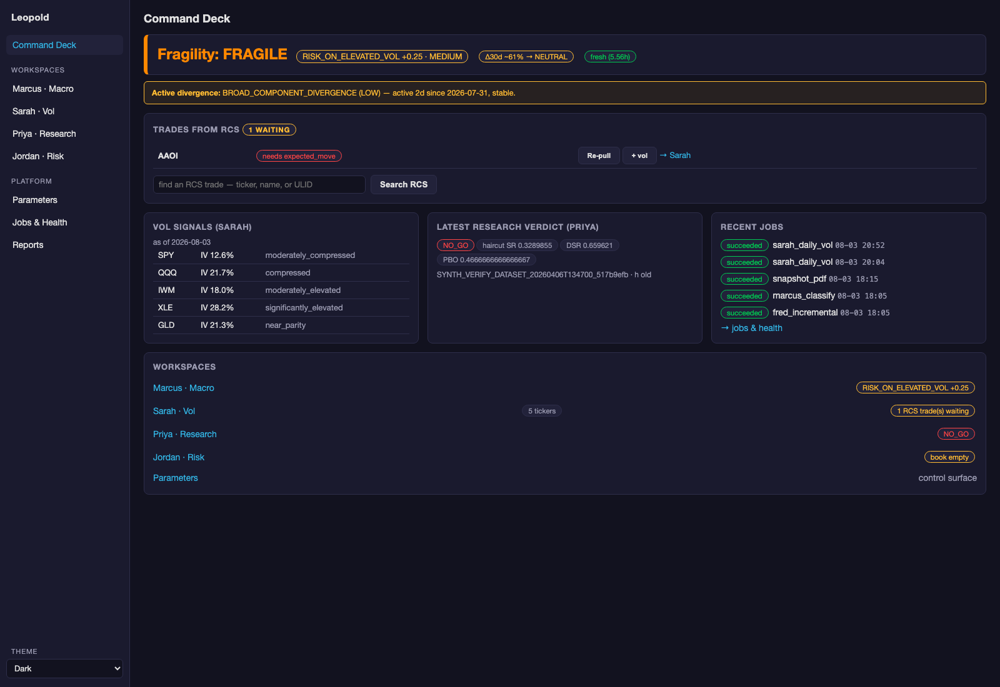

# Workflow — the Morning Routine

*Goal: in under five minutes, know the environment, its fragility, what the
options market is pricing, and whether anything of yours is at risk.*

## 0. Did anything break overnight? (10 seconds)

The **alerts feed** (Jobs & Health, also macOS notifications): job failures
after retries, dependency refusals, limit breaches from the automated
`jordan_daily_check`. Empty feed = the machine ran its own morning. The
scheduler already ran `sarah_daily_vol → jordan_daily_check` at 08:00 (or
will catch up when the API wakes) — you read results, you don't launch jobs.

## 1. Command Deck (the 7am screen)

Open http://localhost:5173. Read top-down — the hierarchy is deliberate
(fragility first, label second):

1. **Fragility**: STABLE (green) → skim and move on. WATCH → read the
   divergence banner: which pair, how long active, intensifying or
   resolving? FRAGILE/BREAKING → today is a risk-review day, not an
   entry day.
2. **Regime badge + freshness chip**: if the contract is stale (red),
   nothing downstream is trustworthy — run `fred_incremental` →
   `marcus_classify` from the Jobs page and come back.
3. **Transition probability**: `Δ30d ~35% → CAUTION` means one-in-three
   odds the label worsens within a month — pre-read the implications for
   that regime, not just the current one.
4. **Vol snapshot**: any ticker whose VRP flipped (`inverted` after weeks
   of `elevated`) or whose IV jumped is your first deep-dive.
5. **Recent jobs**: any red = read its log tail before trusting today's
   data (exhausted-retry failures will already have alerted).

## 2. Marcus page (context, 60 seconds)

- **Interpretation cards**: the vol and credit reads with their amber
  *watch conditions* — these are the two or three numbers to actually watch
  today (e.g. "HY above 450bps activates LEADING_STRESS_WARNING").
- **State vector**: aligned vs contradicting chips; a `CREDIT_LED_STRESS`
  configuration with calm vol is the classic pre-spike setup.
- **Analogues**: when did the macro last look like this, and what regime
  followed? (Reference, not forecast.)
- **Calendar**: anything red (FOMC, CPI) inside your typical holding period?

## 3. Sarah page (what's priced, 60 seconds)

Vol monitor row-by-row: IV vs its rank (cheap/rich *relative to its own
year*), VRP signal (seller's tailwind or inverted danger), term-structure
shape (humped = the market knows an event you should know), skew (is
protection bid?). Click any ticker for the four charts (IV-vs-RV, term
structure, surface heatmap, vol cone). On WATCH/FRAGILE days, also glance
at the **Regime library** tab's VVIX monitor — the "nervous calm" pattern
(VVIX elevated, VIX quiet) is the early-warning read
([regime context](regime-context.md)).

## 4. Jordan page (your risk, 60 seconds)

**Analyze book** → breach banner is the only thing that matters first.
Then net delta/vega dollars vs limits utilization, per-position pricing
errors (a dead ticker = check the journal), and — on stress days —
**Analyze + stress** to see the book under March-2020 et al.

## 5. Journal (RCS :8099)

Exposure board: staleness sweep, overdue actions, any thesis whose kill
conditions the morning's data just fired.

## When something's off

Divergence active → [Marcus doc](../01-components/marcus-macro-regime.md#the-analytical-layers-on-top) for what each type means ·
data stale → [running-and-operating.md](running-and-operating.md#common-issues) ·
limit breached → [risk-and-sizing.md](risk-and-sizing.md).
