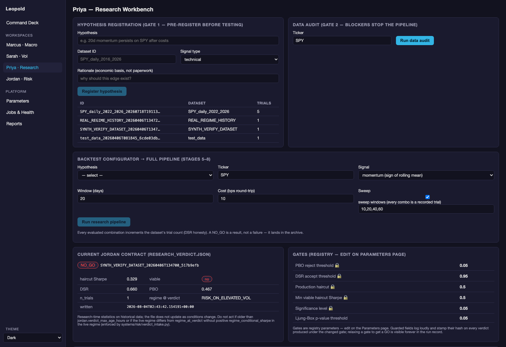

# Workflow — Research Validation (Priya workbench)

*From idea to GO/NO_GO without fooling yourself. The whole design makes the
honest path the only path — and since Phase 4 it's a guided GUI flow.*

## 0. Before touching data — register (Gate 1)

Workbench → **Hypothesis registration**: hypothesis text, dataset ID
(e.g. `SPY_daily_2022_2026`), signal type, and *the rationale* — why should
this edge exist economically? Registration before testing is what makes the
later multiple-testing correction honest. Identical content returns the
existing ID (no accidental duplicates).

## 1. Audit the data (Gate 2)

**Data audit runner**: ticker → blockers vs flags. Blockers (too little
history, look-ahead) stop you. Flags (time-bar pathologies → serial
correlation) go into how you read the later statistics, not the bin.

## 2. Configure and run (Stages 5–8, one click)

**Backtest configurator**: pick your hypothesis, ticker, signal (momentum /
mean-reversion as teaching scaffolds), either a single parameter set or a
**sweep** (comma list of windows), and costs in bps. *Run research
pipeline* (30–90s).

What happens automatically — the discipline you no longer have to remember:
- every sweep combination is **recorded as a trial** against the dataset
  (visible immediately in the hypothesis table's trial count);
- the pipeline pulls that trial count for DSR (no more silent
  undercounting);
- the equity trade log for the execution-cost gate is **built from the
  backtest itself**;
- the verdict is stamped with the **regime it was validated under** and the
  active gate-parameter hashes.

## 3. Read the result

Two healthy outcomes:

**A gate stopped the run** (red box, e.g. `PBO=0.467 ≥ 0.05`): the
in-sample winner doesn't generalize — the "edge" was parameter-selection
luck. Trials were still recorded. This is the product working; archive the
lesson and move on. **Never optimize PBO down** — it's a diagnostic, not a
score.

**A verdict** (GO or NO_GO banner + gate chips + panels):
- `DSR < 0.95` with many trials → the Sharpe didn't survive honest
  counting.
- `viable_after_haircut = false` → possibly real, but too small to survive
  the assumed 50% production degradation.
- **CPCV path chart**: five Sharpes from five re-splits of history — you
  want them clustered and positive, not one hero path.
- **Regime-conditional table**: profitable only in RISK_ON = a regime bet,
  not an edge; Jordan will hold you to this table at sizing time.
- `min_track_record` in years: how long live before the number is
  believable. Humbling on purpose.

NO_GO runs land in the **failure archive** (run archive → Failure archive
filter) — negative results are kept deliberately so dead ideas aren't
re-run in six months.

## 4. Gates are parameters — with teeth

The **Gates card** shows current thresholds (PBO < 0.05, DSR > 0.95,
haircut 50%, min viable haircut Sharpe 0.5…). They're `guarded` registry
fields: editable on the Parameters page, but every change is versioned,
loudly logged, and **stamped onto any verdict produced under it** —
relaxing a gate to get a GO is visible forever.
([How and why-not](editing-parameters.md#component-specific-cautions).)

## 5. After a GO

Nothing is tradeable yet. The verdict goes to
[Jordan's intake](risk-and-sizing.md) — freshness and regime compatibility
are re-checked *at decision time*, not validation time. A GO validated in
RISK_ON does not survive a flip to RISK_OFF unnoticed: the contract carries
`regime_at_verdict` precisely so the intake can catch the shift.

## Going beyond the built-in signals

The two workbench signals are deliberately simple. When a real hypothesis
needs its own signal code, follow `scripts/verify_priya_integration.py` as
the worked example of driving `ResearchPipeline` directly — the same gates,
counters, and archive apply. Deeper mechanics:
[Priya component page](../01-components/priya-research-engine.md) and
[audit #4](../../audit/04_priya_research_layer.md).
